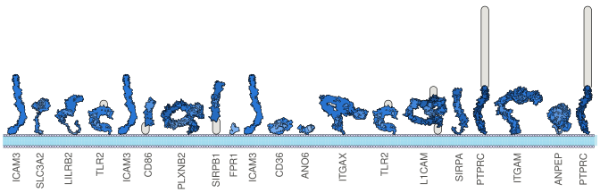
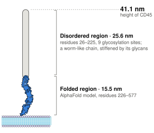
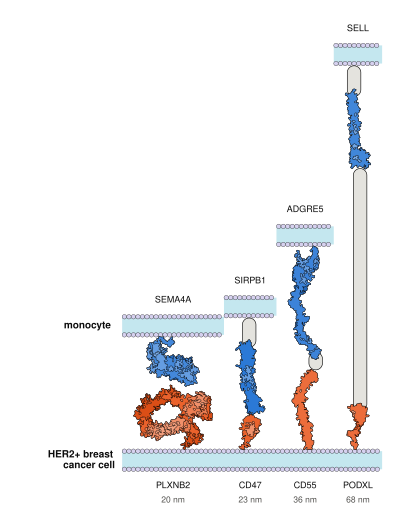
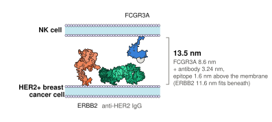
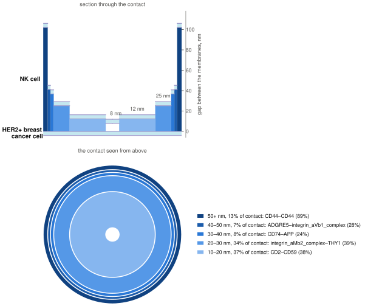

# The cell surface topography

This repository estimates how far each of the 3,146 human cell-surface proteins extends from
the membrane, and uses those heights to describe the surfaces of immune and cancer cells and
the gaps between two cells in contact.

<p align="center">
  <picture>
    <source media="(prefers-color-scheme: dark)" srcset="docs/img/monocyte_surface_dark.svg">
    
  </picture>
  <br>
  <sub>Twenty proteins sampled by abundance from a classical monocyte's surface (Ravenhill et al.
  2020), drawn to scale with <a href="https://github.com/jordisr/cellscape">CellScape</a> by Jordi
  Silvestre-Ryan and oriented by their topology. Grey capsules are height without a structure:
  disordered regions, domains, or a whole protein with no AlphaFold model, like LRP1, which is
  shortened at the break.</sub>
</p>

> **Status.** Analysis code for a manuscript in preparation. Result tables and figures will be
> posted when it is published; until then, the pipeline regenerates them in about two minutes.
> Figure numbers follow the draft and may change.

## Quick start

```bash
conda env create -f environment.yml
conda activate surfaceome
python code/database/fetch_restricted_inputs.py
python code/run_notebooks.py out
```

`fetch_restricted_inputs.py` downloads three inputs that are not included in the repository
(about 45 MB) and checks each against the file the analysis was run on.

The run takes about two minutes on a laptop and writes tables to `out/database/` and
`out/tables/`, figures to `out/figures/`, and the executed notebooks to `out/notebooks/`.

## The method

**1. Heights.** A protein's height is the length of its extracellular region, the
*ectodomain*, with its folded and disordered parts laid end to end along the membrane normal.
It is therefore an upper bound: a tilted or bent ectodomain stands lower. Each residue is
assigned to one source, in this order of preference:

| source | height it contributes |
|---|---|
| AlphaFold v6 model, trimmed to its confident span | longest dimension of the model's inertia-axis bounding box |
| disordered segment (MobiDB, and low-confidence AlphaFold stretches) | end-to-end distance of a worm-like chain, stiffer with more glycosylation |
| Pfam domain not covered by a model | the family's height, measured on solved structures as how far one domain advances its chain |
| any residue left | 0.04 nm |

<p align="center">
  <picture>
    <source media="(prefers-color-scheme: dark)" srcset="docs/img/cd45_dark.svg">
    
  </picture>
</p>

The result is one height per gene for every reviewed human protein with an extracellular
domain or a GPI anchor (`out/database/height_estimates.csv`).

**2. Cell surfaces.** A cell type's surface is the surfaceome proteins detected in its
proteome, each weighted by its share of total abundance.

**3. Contacts.** Pairs that bind across two cells come from STRING and CellphoneDB. A pair's
height is the sum of its partners' heights, unless a recorded rule gives another (a measured
model of the complex, or partners that bind side by side). For an immune cell facing a cancer
cell, the pairs both can form give the distribution of gaps between the membranes.

<p align="center">
  <picture>
    <source media="(prefers-color-scheme: dark)" srcset="docs/img/contact_dark.svg">
    
  </picture>
  <br>
  <sub>An NK cell against a HER2-positive breast cancer cell treated with trastuzumab (anti-HER2).
  In each band of gap heights, the pair holding most of it among pairs of two single proteins whose
  height is the sum of the partners' (NK-cell partner blue, cancer-cell partner orange), labelled
  with its height; drawn heights are illustrative.</sub>
</p>

<p align="center">
  <picture>
    <source media="(prefers-color-scheme: dark)" srcset="docs/img/bridge_dark.svg">
    
  </picture>
  <br>
  <sub>The same contact's antibody bridge, as the pipeline models it: trastuzumab binds HER2 next to
  the membrane, so the gap is the Fc receptor (CD16, FCGR3A) plus the antibody's 3.24 nm, and HER2
  must fit beneath. The antibody is an intact human IgG1 (PDB 1HZH).</sub>
</p>

<p align="center">
  <picture>
    <source media="(prefers-color-scheme: dark)" srcset="docs/img/bullseye_dark.svg">
    
  </picture>
  <br>
  <sub>The whole contact (Figure 6). Below, the bullseye: one ring per band of gap heights, each
  ring's area its share of the contact. Above, a section through its centre: over each ring, the
  membranes stand at the mean gap of the pairs holding it. Radius is share of the contact, not
  distance.</sub>
</p>

[`docs/METHODS.md`](docs/METHODS.md) gives each rule, its parameters and its basis.

## The code

`code/run_notebooks.py` runs the method, then draws the figures from its tables
(`--stage database` or `--stage figures` runs one stage).

The method is three notebooks in `code/database/notebooks/`:

| notebook | builds |
|---|---|
| `01_height_estimates` | the height of every surfaceome protein |
| `02_cellphonedb_interactions` | CellphoneDB pairs and complexes |
| `03_interaction_heights` | the height of each bound pair |

The figures are drawn by one notebook each in `code/figures/notebooks/`:

| notebook | figure |
|---|---|
| `F1_domain_sizes` | 1: domain heights by Pfam family |
| `F2_height_histograms` | 2: heights across the surfaceome |
| `F3_F4_expression_weighted_topography` | 3–4: cell surfaces weighted by abundance |
| `F4_ravenhill_monocyte_subtypes` | 4: monocyte subtypes |
| `F5_david_clusters` | 5: functional clusters of bound pairs |
| `F6_cell_contacts` | 6: four immune–cancer cell contacts |
| `S2_methods_vs_structures` | S2: predicted heights against solved structures |

[`code/figures/figure_map.csv`](code/figures/figure_map.csv) maps each output file to its
manuscript panel. The illustrations in this README are drawn from a run's output with
[CellScape](https://github.com/jordisr/cellscape) by `code/figures/cellscape/readme_images.py`,
in its own environment (`code/figures/cellscape/environment.yml`).

## Using the heights for your own cells

```python
import pandas as pd
from surfaceomeTopography import cell_surface, mean_height, plot_surfaces

heights = pd.read_csv("out/database/height_estimates.csv")
expression = pd.read_csv("my_expression.csv")  # a "uniprot" column, then one column per cell type
table = expression.merge(heights, left_on="uniprot", right_on="ID link_first")

surface = cell_surface(table, "my cell type")  # proteins it expresses, each with its share
mean_height(surface)                           # abundance-weighted mean height, nm
plot_surfaces({"my cell type": surface}).savefig("my_cell_type.pdf")
```

## Repository layout

```
code/
  run_notebooks.py          runs the pipeline
  surfaceome_config.py      locates inputs under data/ and outputs under the run directory
  surfaceomeTopography/     the Python library the notebooks use
  database/notebooks/       the method
  database/inputs/          rebuild the inputs from their public sources (build_inputs.py runs them)
  figures/notebooks/        the manuscript figures
  figures/validation/       solved structures and complex models, for checking the heights
  figures/cellscape/        the README illustrations
data/
  curated/                  decision tables and their citations
  inputs/                   external inputs, by source
  measurements/             domain and structure measurements made for this work
docs/METHODS.md             the method in full
docs/img/                   the README illustrations
```

[`data/README.md`](data/README.md) describes each input file.

## Data sources

| used for | source | version |
|---|---|---|
| proteome | [UniProt](https://www.uniprot.org) reference proteome UP000005640 | 2026_02 |
| structural models | [AlphaFold DB](https://alphafold.ebi.ac.uk) | v6 |
| domains | [Pfam](https://www.ebi.ac.uk/interpro/entry/pfam/), searched with HMMER | 38.2 |
| disorder | [MobiDB](https://mobidb.org) | 2026 |
| glycosylation, experimental | [GlyGen](https://www.glygen.org) | 2.11.1 |
| glycosylation, predicted | GlycoMine (Li et al. 2015, *Bioinformatics* 31:1411) | 2014 |
| surface classification | [SURFY](https://wollscheidlab.org/SURFY) (Bausch-Fluck et al. 2018, *PNAS* 115:E10988) | 2018 |
| protein abundance | [Expression Atlas](https://www.ebi.ac.uk/gxa/home) E-PROT-1 and E-PROT-27 | 2026 download |
| monocyte subtypes | Ravenhill et al. 2020, *Sci Rep* 10:4560, Table S1C | 2020 |
| interactions | [STRING](https://string-db.org) | v12.0 |
| interactions and complexes | [CellphoneDB](https://www.cellphonedb.org) | v5.0.0 |
| functional clusters | [DAVID](https://davidbioinformatics.nih.gov) | knowledgebase v2025_1 |
| checking the heights | [SIFTS](https://www.ebi.ac.uk/pdbe/docs/sifts/) and the [PDB](https://www.rcsb.org) | 2026-09-08 |

`python code/database/build_inputs.py --list` shows how each input is rebuilt from its source.
That needs HMMER, PyMOL and about 5 GB of AlphaFold models; running the analysis does not.

## Limitations

- **Heights are upper bounds.** They assume each ectodomain is fully extended, so the gaps
  between cells in contact are upper bounds too.
- **Disordered, heavily glycosylated regions**, such as mucin stalks, rely on a polymer model
  with few measurements to test it against.
- **Solved structures are used only to check heights**, and cover a minority of ectodomains.
- **The surfaceome is inclusive**: it includes some proteins annotated only to intracellular
  membranes. Each protein carries a location and surface-evidence classification for filtering.
- **Contacts assume every pair binds equally well**, since binding strengths are unknown for
  most pairs.
- **Antibody bridges assume the antibody binds next to the membrane**, as trastuzumab does on
  HER2.

## Environment

Python 3.9 and pandas 1.5, pinned in [`environment.yml`](environment.yml): later pandas versions
change grouping defaults in ways that alter results without an error.

## Licence

Code: MIT ([`LICENSE`](LICENSE)). Data made for this work (`data/curated/`,
`data/measurements/`): CC BY 4.0 ([`data/LICENSE`](data/LICENSE)).

## Acknowledgements

The protein illustrations, here and in the manuscript, are drawn with
[CellScape](https://github.com/jordisr/cellscape), Jordi Silvestre-Ryan's tool for turning
protein structures into vector cartoons and composing them into cell-surface scenes:

> Silvestre-Ryan J, Fletcher DA, Holmes I. CellScape: Protein structure visualization with
> vector graphics cartoons. *bioRxiv* 2022.
> [doi:10.1101/2022.06.14.495869](https://doi.org/10.1101/2022.06.14.495869)
